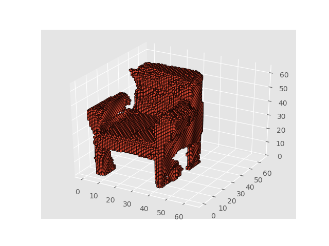
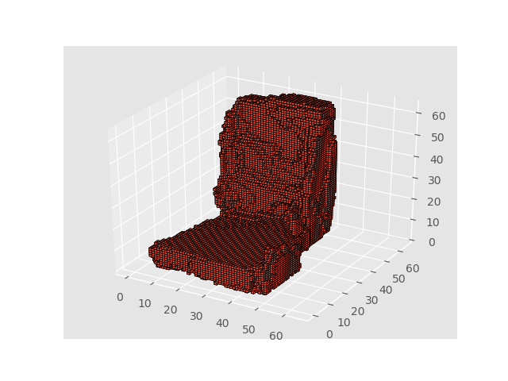
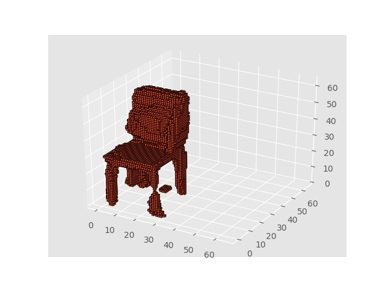
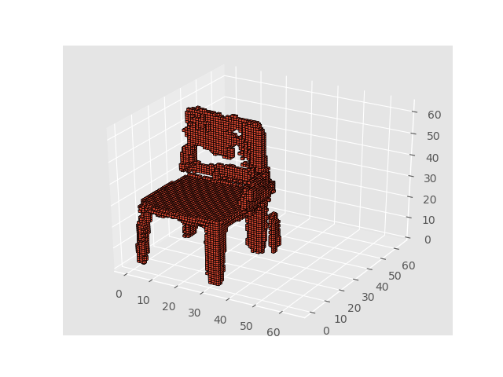
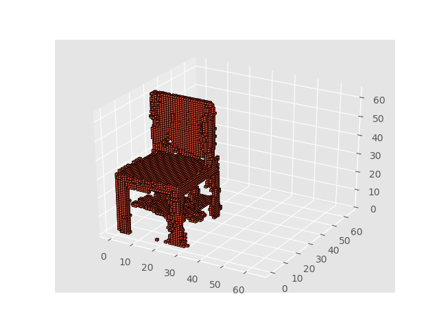
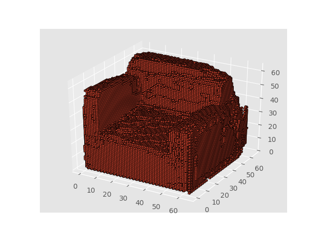
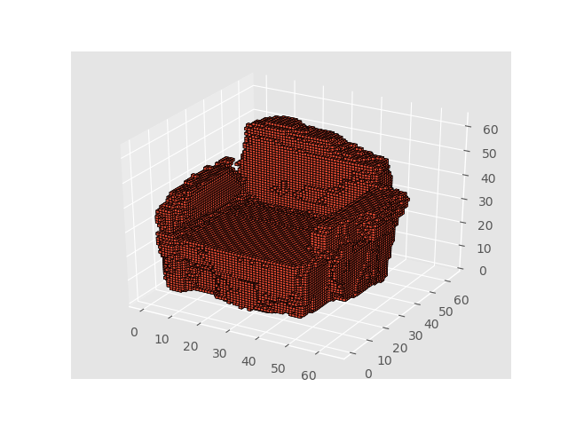

# 3dgan-chainer

[](https://arxiv.org/abs/1610.07584)


## Chainer implementation of 3D Generative Adversarial Network.

### Result
Some **good** samples generated chairs. (50epoch)





### Requirements

- chainer(2.0.1)
- scipy
- scikit-image
- h5py

```
pip install scipy scikit-image h5py
```

#### Optional

- If you want to plot voxel, [latest matplotlib](https://github.com/matplotlib/matplotlib) is needed. 

  The [3D voxel / volumetric plot](https://matplotlib.org/devdocs/gallery/mplot3d/voxels.html) function is included only in unreleased version of matplotlib as of Oct 19, 2017

  - matplotlib 2.1.0+323.ge6448bafc

  ```
  pip install git+https://github.com/matplotlib/matplotlib
  ```

### Dataset

I used **ShapeNet-v2** dataset.  Training script support `.binbox` or `.h5` extension.

Describe your dataset path to `DATASET_PATH` in `train.py`.

#### .binvox

Just use `.binvox` files in ShapeNet-v2. 

#### .h5

Assuming that `.h5` has ``{ 'data': <np.array, shape (64, 64, 64)> }``. If you want to convert `.binvox` into `.h5`, use `binvox_to_h5.py` script.

### Usage

#### Training

```
python train.py
```

#### Generation

```
python generate_samples.py <model_file> <save_dir> <num samples>
```

##### Visualization

If you have `.binvox` file,  using [simple-voxel-viewer](https://github.com/piyo56/simple_voxel_viewer) is easy way.

Or visualize with matplotlib, 
```
python visualize.py <binvox file or directory>
```
